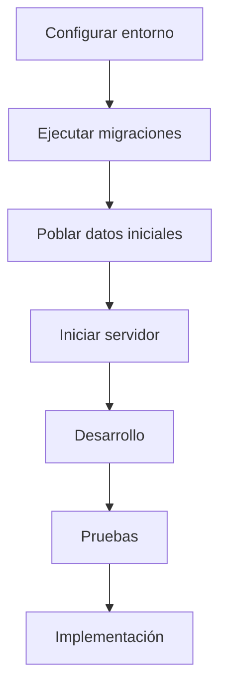
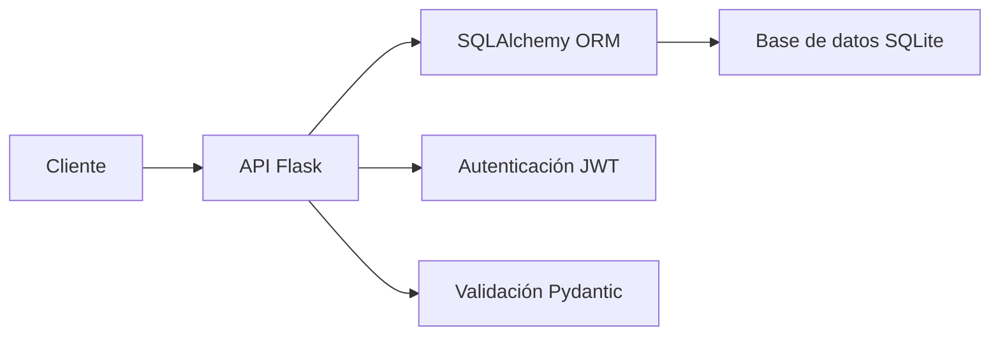

# 📦 Sistema de Gestión de Inventario Industrial

<div align="center">
  
  
  
  
  
</div>

<p align="center">
  Una API RESTful moderna para gestión de inventario industrial, construida con Flask, SQLAlchemy y autenticación JWT.
</p>

## 📋 Tabla de Contenidos

- [Características](#-características)
- [Requisitos](#-requisitos)
- [Instalación](#-instalación)
- [Configuración del entorno](#-configuración-del-entorno)
- [Inicialización de la base de datos](#-inicialización-de-la-base-de-datos)
- [Ejecución](#-ejecución)
- [Endpoints de la API](#-endpoints-de-la-api)
- [Documentación API con Swagger](#-documentación-api-con-swagger)
- [Pruebas unitarias](#-pruebas-unitarias)
- [Estructura del proyecto](#-estructura-del-proyecto)

## ✨ Características

### 🏭 Gestión de Inventario

- **Productos**: Creación, edición y gestión de productos
- **Categorías**: Organización de productos por categorías
- **Ubicaciones**: Control de ubicaciones de almacenamiento
- **Proveedores**: Administración de información de proveedores

### 📈 Control de Stock

- **Movimientos**: Registro de entradas, salidas y ajustes
- **Alertas**: Notificación de stock bajo mínimo
- **Historial**: Registro de todos los movimientos por producto

### 🔐 Seguridad

- **Autenticación JWT**: Sistema de login con email/contraseña
- **Cookies seguras**: Manejo de tokens mediante cookies HttpOnly
- **Protección CSRF**: Medidas contra falsificación de solicitudes
- **Sanitización de datos**: Prevención de inyección SQL y XSS

## 🔧 Requisitos

- Python 3.8 o superior
- pip (gestor de paquetes de Python)
- Entorno virtual de Python (recomendado)
- SQLite (incluido por defecto)

## 💻 Instalación

### 1. Descomprimir la carpeta

### 2. Crear y activar entorno virtual

#### 🐧 Linux / macOS / Windows

```bash
# Crear entorno virtual
python3 -m venv venv

# Activar en Windows
venv\Scripts\activate

# Activar en macOS/Linux
source venv/bin/activate
```

### 3. Instalar dependencias

```bash
pip install -r requirements.txt
```

## 🔄 Configuración del entorno

Crea un archivo `.env` en la raíz del proyecto con la siguiente configuración:

```env
# Configuración de entorno
DEBUG=True
PORT=5000
ENVIRONMENT=development

# Base de datos
DATABASE_URL=sqlite:///./inventory.db

# Seguridad
JWT_SECRET_KEY=tu_clave_secreta_muy_larga_y_segura
CORS_ORIGINS=*
```

o usar el  `.env` que viene anexado.

## 🗃️ Inicialización de la base de datos

### 1. Generar las migraciones iniciales

```bash
alembic revision --autogenerate -m "initial_migration"
```

### 2. Aplicar las migraciones

```bash
alembic upgrade head
```

### 3. Crear usuario inicial de prueba

```bash
python -m app.db.init_user
```

### 4. Poblar la base de datos con datos de ejemplo

```bash
python -m app.db.seed-script
```

## 🚀 Ejecución

Para iniciar el servidor de desarrollo:

```bash
python -m app.main
```

La API estará disponible en: http://localhost:5000

## 🔑 Credenciales de acceso

- **Email**: usertesting@qpalliance.co
- **Password**: TestingQp#1

## 🌐 Endpoints de la API

La API está organizada en los siguientes grupos de recursos:

- **Auth**: `/api/v1/auth/` - Autenticación y gestión de usuarios
- **Products**: `/api/v1/products/` - CRUD de productos
- **Categories**: `/api/v1/categories/` - CRUD de categorías
- **Locations**: `/api/v1/locations/` - CRUD de ubicaciones
- **Suppliers**: `/api/v1/suppliers/` - CRUD de proveedores
- **Movements**: `/api/v1/movements/` - Gestión de movimientos de inventario

### Flujo de autenticación

1. **Login**: `POST /api/v1/auth/login`
   
   ```json
   {
     "email": "usertesting@qpalliance.co",
     "password": "TestingQp#1"
   }
   ```

2. Esto devolverá los datos del usuario y establecerá cookies de sesión para:
   
   - `access_token`: Token JWT de acceso (30 minutos)
   - `refresh_token`: Token JWT de refresco (7 días)

3. Para endpoints protegidos, el token se envía automáticamente en las cookies o en el encabezado:
   
   ```
   Authorization: Bearer {token}
   ```

## 📚 Documentación API con Swagger

La documentación interactiva de la API está disponible en:

```
http://localhost:5000/api/docs
```

### Uso de Swagger UI:

1. Accede a la URL de la documentación
2. Inicia sesión con el endpoint `/api/v1/auth/login`
3. Copia el token devuelto
4. Haz clic en el botón "Authorize" en la parte superior derecha
5. Introduce el token en el formato: `Bearer {token}`
6. Ahora puedes probar todos los endpoints protegidos

## 🧪 Pruebas unitarias

Para ejecutar las pruebas unitarias:

```bash
python -m unittest tests/tests_inventory_api.py
python -m unittest tests/test_auth.py 
python -m tests.test_api
```

## 📁 Estructura del proyecto

```
.
├── alembic/                  # Configuración y migraciones de Alembic
├── app/                      # Código principal de la aplicación
│   ├── api/                  # Endpoints de la API
│   │   └── v1/               # Versión 1 de la API
│   │       ├── endpoints/    # Módulos de endpoints por recurso
│   │       └── __init__.py   # Registro de blueprints
│   ├── auth/                 # Lógica de autenticación
│   ├── db/                   # Configuración de base de datos
│   │   ├── base.py           # Configuración SQLAlchemy
│   │   ├── init_user.py      # Script para crear usuario inicial
│   │   ├── seed-script.py    # Script para poblar datos de prueba
│   │   └── session.py        # Gestión de sesiones de BD
│   ├── models/               # Modelos SQLAlchemy (ORM)
│   ├── schemas/              # Esquemas Pydantic para validación
│   ├── services/             # Lógica de negocio
│   ├── utils/                # Utilidades
│   └── main.py               # Punto de entrada principal
├── tests/                    # Pruebas unitarias
├── .env                      # Variables de entorno (crear manualmente)
├── alembic.ini               # Configuración de Alembic
├── requirements.txt          # Dependencias del proyecto
└── README.md                 
```

## 🔄 Flujo de Desarrollo



## 🚧 Diagrama de la arquitectura



## 📝 Notas adicionales

- Este proyecto usa SQLite por defecto para facilitar el desarrollo, pero puede configurarse para usar PostgreSQL, MySQL u otros sistemas de bases de datos modificando la variable `DATABASE_URL` en el archivo `.env`.
- Para entornos de producción, asegurarse de cambiar `DEBUG=False` y generar una clave secreta segura para `JWT_SECRET_KEY`.
